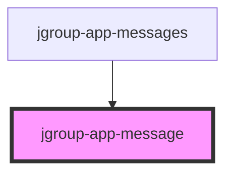

# jgroup-app-message

<!-- Auto Generated Below -->

## Properties

| Property  | Attribute | Description                     | Type                                          | Default     |
| --------- | --------- | ------------------------------- | --------------------------------------------- | ----------- |
| `heading` | `heading` | The heading of the message.     | `string`                                      | `undefined` |
| `message` | `message` | The message to display.         | `string`                                      | `undefined` |
| `type`    | `type`    | The type of message to display. | `"error" \| "info" \| "success" \| "warning"` | `'info'`    |

## Events

| Event     | Description                                  | Type                  |
| --------- | -------------------------------------------- | --------------------- |
| `dismiss` | Event emitted when the message is dismissed. | `CustomEvent<number>` |

## Dependencies

### Used by

 - [jgroup-app-messages](../jgroup-app-messages)

### Graph

----------------------------------------------

*Built with [StencilJS](https://stenciljs.com/)*
