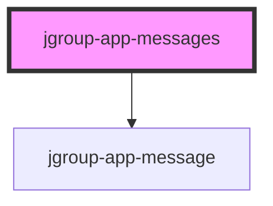

# jgroup-app-messages

<!-- Auto Generated Below -->

## Properties

| Property         | Attribute         | Description                                | Type     | Default     |
| ---------------- | ----------------- | ------------------------------------------ | -------- | ----------- |
| `appKey`         | `app-key`         | The app key to fetch messages for.         | `string` | `undefined` |
| `appSectionKey`  | `app-section-key` | The section key to fetch messages for.     | `string` | `undefined` |
| `userIdentifier` | `user-identifier` | The user identifier to fetch messages for. | `string` | `undefined` |

## Dependencies

### Depends on

- [jgroup-app-message](../jgroup-app-message)

### Graph

----------------------------------------------

*Built with [StencilJS](https://stenciljs.com/)*
